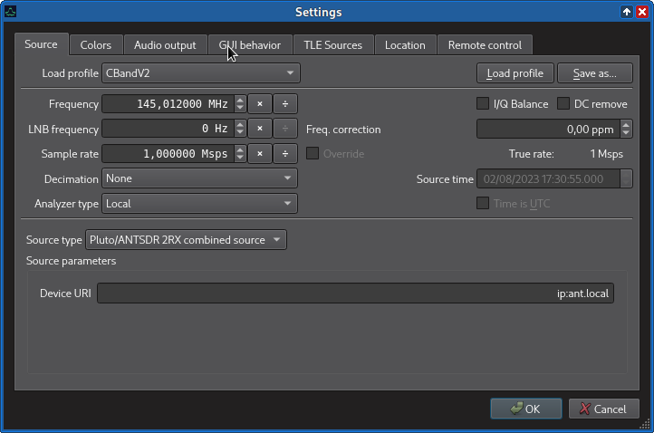
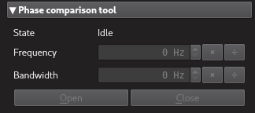
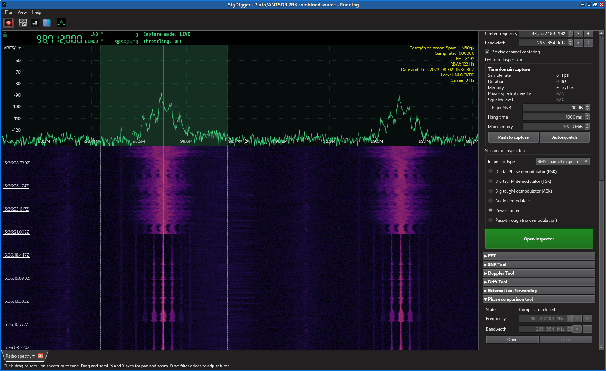
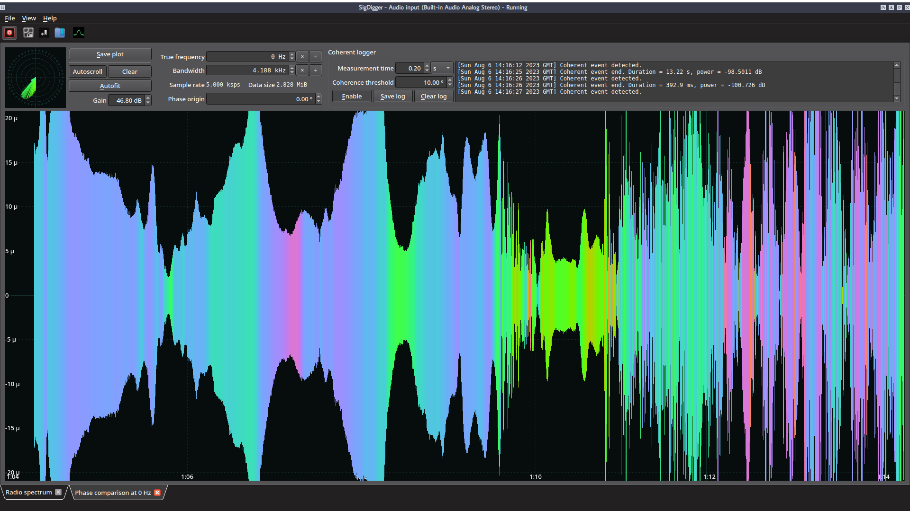
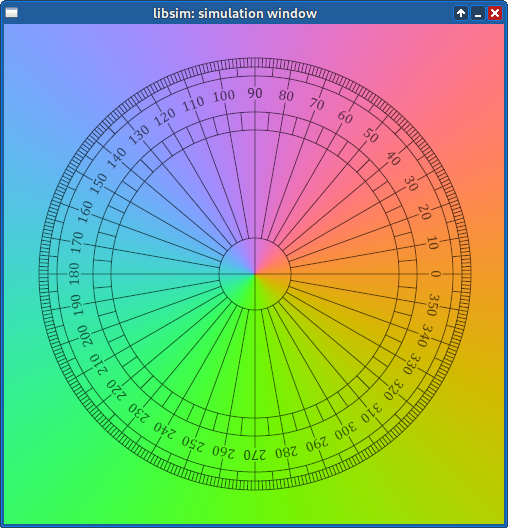

# AntSDRPlugin
This is ANTSDR 2RX hack plugin for SigDigger, for phase detection. It implements:

1. A new signal source named "Pluto/ANTSDR 2RX combined source"
2. A tool widget named "Phase comparison tool"

## Requirements
* AntSDR / Pluto with dual RX and 2r2t enabled.
* Latest SigDigger headers from `develop`. These are installed in your system when you build SigDigger from the command line and run `sudo make install`.
* [libiio](https://github.com/analogdevicesinc/libiio) and associated development files
* [libad9361](https://github.com/analogdevicesinc/libad9361-iio) and associated development files

## Usage
1. Select the "Pluto/ANTSDR 2RX combined source as input source", and specify the IP at which it can be found (by default, 192.168.1.10 if you are using the Ethernet interface, 192.168.2.1 if you are using the USB interface)
  

2. Start the capture. You will see the spectrum doubled around the center frequency.
   

3. Select either one of the doubled channels. This is the channel whose phase we are going to measure.
   
   
4. In the side panel, scroll down to the Phase Comparison tool, and click open. A new tab will open with a colored plot.
   

5. The amplitude is proportional to the power of the signal in both channels. The color represents the phase difference between both channels. The color is taken from the YIQ color wheel
   
